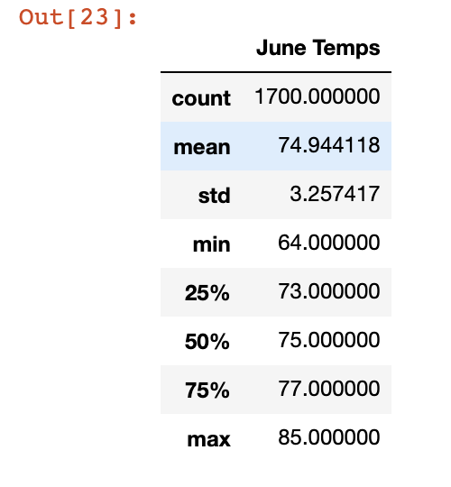
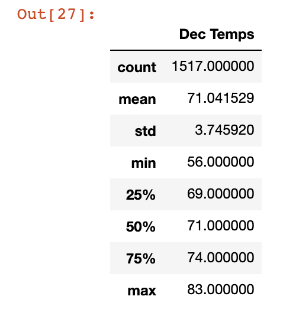
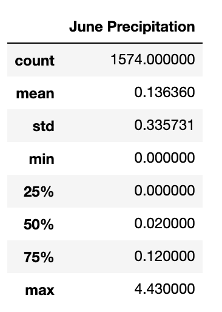

# Surfs Up Analysis
## Overview of Analysis
The purpose of this analysis was to leverage SQLite and SQLAlchemy to create sql engines on local servers to conduct queries that analyzed key weather trends for a new app for a surf shop

## Results
After conducting this analysis, there are some key data trends to highlight:
- Overall, the average temperature is warmer in June (~75) compared to Dec (~71)
- June also has a larger sample size of temperatures (~1700), which means the data can be described as more reliable and accurate with more data to analyze compared to Dec (~1500)
- Lastly, while December is often deemed a 'cold' month, the hotest day (83) of the month was only 2 degrees cooler than June (85) which is considered part of the 'Summer' months

   

## Summary
When evaluating both months, we can see that June is a warmer month compared to December, which logically makes sense. Based on this, we can understand that June will provide warmer days for business compared to December, which should help with sales at the Surf Shop. With that said, we would also want to know how 'wet' these two months were to ensure that not only with warmer days compared to December, that June is not a 'wash out' with heavy precipitation. To do this, we could query the precipitation levels for both months using a similar line of code to identify temperatures for each. The outcome from that query will show that June also is considered 'more dry' compared to June as it has on average less rain for the month

